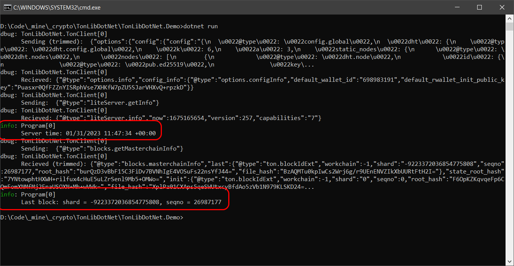

TonLib.NET
===========

Wrapper around `libtonlibjson` library for accessing [Telegram Open Network](https://ton.org/) lite servers (nodes) via ADNL protocol.

**Important!** You need to obtain complied `tonlibjson.dll` (or appropriate for your OS) and its depenencies (e.g. `libcrypto-1_1-x64.dll`) yourself. See below for details.

[](https://www.nuget.org/packages/TonLib.Net/) 


## Usage

Register in `Startup` (for console projects create instance manually or see demo project for hosted sample):

```csharp
services.AddSingleton<ITonClient, TonClient>();
```

And use:

```csharp
// Obtain client from DI
var tonClient = app.Services.GetRequiredService<ITonClient>();

// You need to init it before first use.
// During this, TON network config file is loaded from internet.
// Subsequent calls to `InitIfNeeded` will be ignored, 
//   so no need for you to have additional variable 
//   to remember that you already called it.
await tonClient.InitIfNeeded();

// Use 'Execute' to send requests.
var lsi = tonClient.Execute(new LiteServerGetInfo());
logger.LogInformation("Server time: {Now}", lsi.Now);

var mi = tonClient.Execute(new GetMasterchainInfo());
logger.LogInformation("Last block: shard = {Shard}, seqno = {Seqno}", mi.Last.Shard, mi.Last.Seqno);
```

And the result is:



⚠ All `Execute` requests are syncronous for now. Help is wanted to make them asyncronous.


## Installing dependencies and running a demo

This library is a wrapper around `tonlibjson` library. You need to obtain complied copy of it (and its depenencies) yourself.

### 1. Obtaining `tonlibjson` library

#### Option 1: Build it yourself

1. Checkout https://github.com/ton-blockchain/ton
2. Follow manual at https://ton.org/docs/develop/howto/compile and build `tonlib` target.

#### Option 2: Get compiled one from GitHub Actions

1. Open https://github.com/ton-blockchain/ton/actions
2. Choose your OS (one that matches better) in left "Actions" (Workflows) menu
3. Look for run with tag named like `v2023.01` (or newer) and open that build/run.
4. Scroll down to "Artifacts" section, you'll find something like `ton-win-binaries` file about 70MB in size. Download it.
5. Open downloaded archive and extract `tonlibjson.dll` (or similair for your OS).
6. Make sure this file wil be available for your running program (for example, add it to your project and set "Copy to Output Directory" to "Copy if newer").

### 2. Obtaining dependencies

The number of additional dependencies you need depends of what you already have on your machine.

When something is missed, Demo app will fail with "Unable to load DLL 'tonlibjson' or one of its dependencies" exception. You may use [Process Monitor](https://learn.microsoft.com/en-us/sysinternals/downloads/procmon) to find what file it wants.

On my Win machine I needed `libcrypto-1_1-x64.dll` from OpenSSL.


## Useful links

* TON ADNL API Home: https://ton.org/docs/develop/dapps/apis/adnl
* TonLib TL Schema: https://github.com/ton-blockchain/ton/blob/master/tl/generate/scheme/tonlib_api.tl
* TL Language description: https://core.telegram.org/mtproto/TL